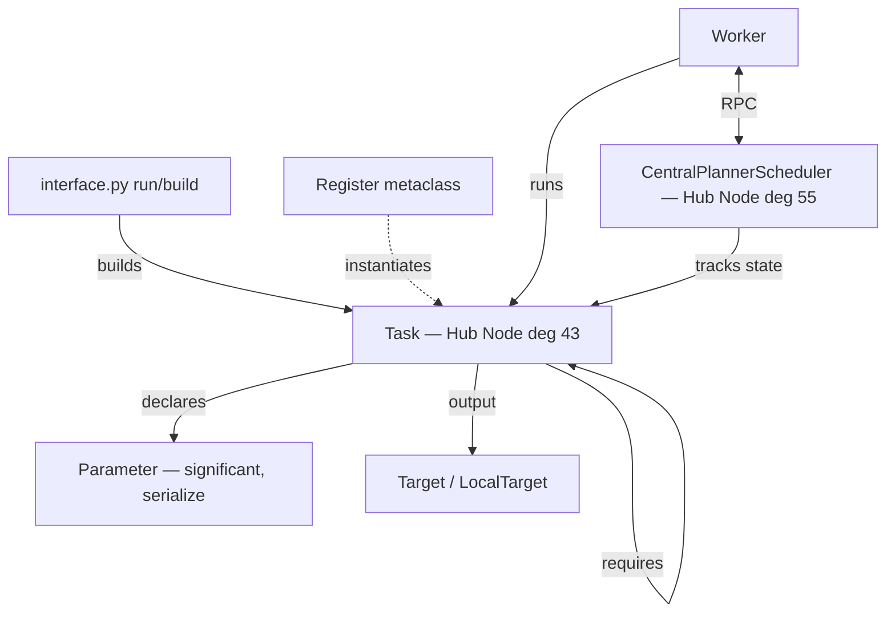
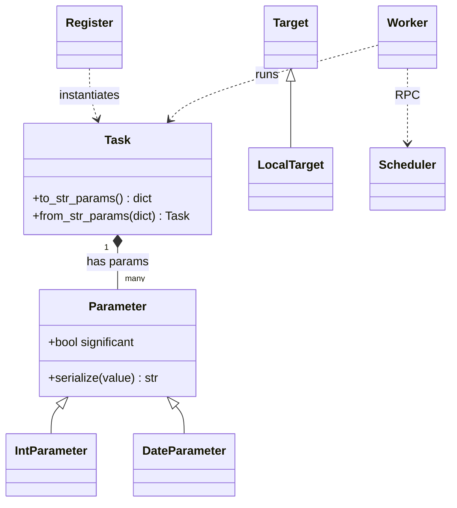
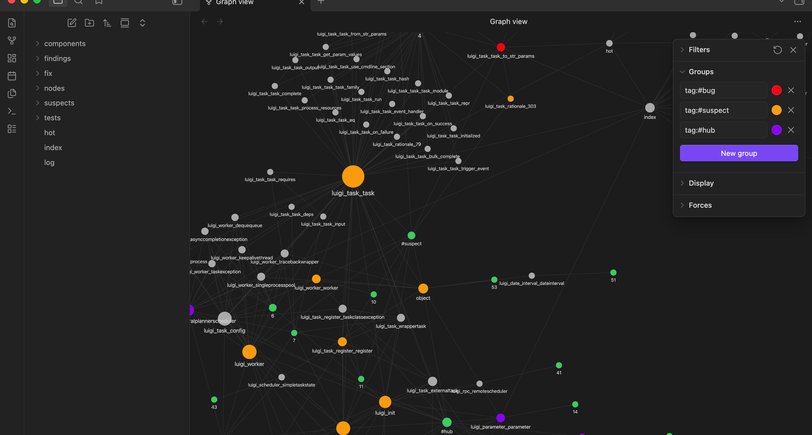
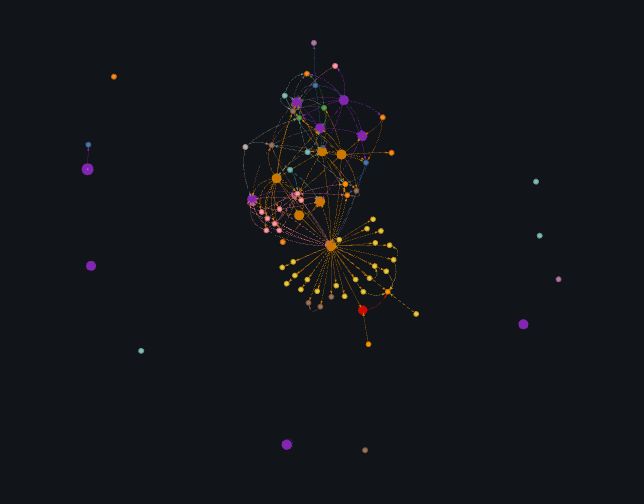
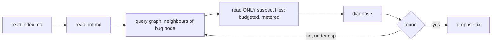
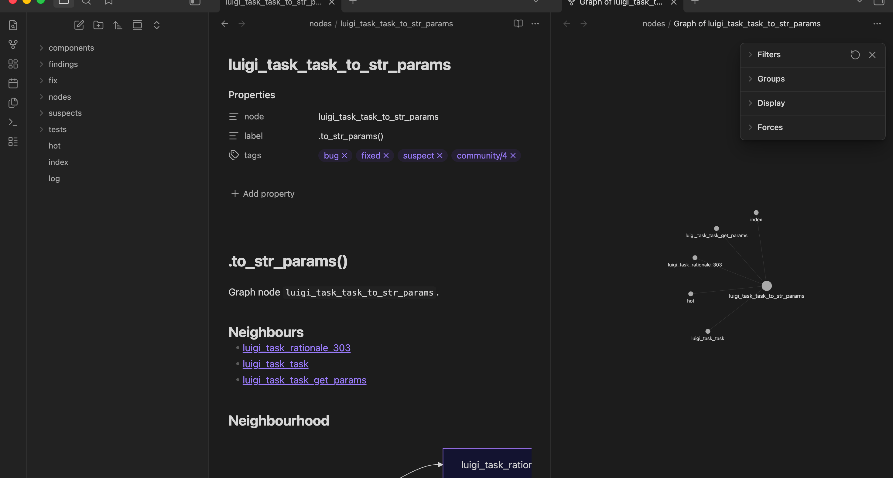
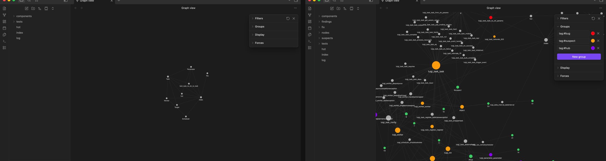

# EX04 — Graph-Guided, Token-Efficient Reverse Engineering & Debugging

[](https://github.com/salah-dev-stu/uoh-sqak-ex04/actions/workflows/ci.yml)

> **Course** 203.3763 "Orchestration of AI Agents" · University of Haifa · Dr. Yoram Segal
> **Group** `uoh-sqak` — Salah Qadah (323039974) + Andalus Kalash (211435797)

Take an **unfamiliar buggy Python codebase** (`spotify/luigi`), turn it into a **Graphify** knowledge
graph + an **Obsidian** vault, run a **graph-guided LangGraph agent** that consults the graph/vault
*before* reading raw code, fix a real bug, and **prove the token savings** versus naive raw-file reading.

**Headline result — measured, not claimed:** graph-guided investigation used **96.1% fewer tokens**
(22,923 → 897) and read **97.1% fewer files** (35 → 1) than naive mode, while finding the same bug.

---

## 1. Chosen repo + why (spec §2, H1)
`spotify/luigi` via the **BugsInPy** dataset (bug **#20**). Vendored at the buggy commit in
[`target_repo/luigi`](target_repo/luigi) (provenance: [`target_repo/PROVENANCE.md`](target_repo/PROVENANCE.md)).

- **Realistic & substantial** — ~21.7k LOC / 82 files, a genuine task-orchestration framework with a
  rich class hierarchy (great for a Hub-Node + OOP story).
- **Installs cleanly** — pure-Python core with light deps, defusing the lecturer's "BugsInPy env is
  acutely hard" warning. We reproduced the bug in an isolated `uv` venv (Python 3.8.3).
- **Small, well-scoped bug** — a 3-line fix in the central `Task` class: ideal for a clear before/after.

## 2. The bug studied (spec §5.4, H5)
`test/task_test.py::TaskTest::test_task_to_str_to_task` round-trips a Task:
`from_str_params(task.to_str_params())`. With a parameter declared `significant=False`, it raises
**`KeyError: 'insignificant_param'`**.

**Root cause — a serialize/deserialize asymmetry:** `Task.to_str_params` only serialized *significant*
params, but `Task.from_str_params` iterates *all* params and indexes the dict directly → the dropped
param is missing on the way back. Full analysis: [`reports/bug_analysis.md`](reports/bug_analysis.md).

## 3. Research questions (spec §4)
| # | Question | Answer (where) |
|---|---|---|
| RQ1 | Actual architecture & surprises | §4 below + [`reports/architecture.md`](reports/architecture.md) — a `Register` metaclass instantiates every Task; `six`/jQuery are *noise* Hub Nodes |
| RQ2 | Most central components | `Task`, `CentralPlannerScheduler`, `Parameter`, `Worker` — [`reports/graph_report_annotated.md`](reports/graph_report_annotated.md) |
| RQ3 | Complexity hotspots / Hub Nodes | degree/betweenness tiers in the annotated report; `Task` mixes identity + scheduling + (de)serialization |
| RQ4 | Extract block + OOP schemas from thin docs | from `graph.json` edges, not prose — [`reports/architecture.md`](reports/architecture.md) |
| RQ5 | How the bug was found + root cause | graph-guided path in [`reports/bug_analysis.md`](reports/bug_analysis.md) |
| RQ6 | Graph + Obsidian vs linear reading | [`reports/token_comparison.md`](reports/token_comparison.md) |
| RQ7 | How graph-guided AI saved tokens | 96.1% — focused context avoids "Lost in the Middle" |
| RQ8 | Further agent mechanisms | §10 extensions + Future Work |

## 4. Architecture extracted from code (spec §5.2, H7/H8)
Built from the **real graph** (`reports/graph/graph.json`: 2253 nodes, 3957 edges), not the docs.

**Architectural block diagram:**


**OOP / class diagram:**

Sources: [`diagrams/block_diagram.mmd`](diagrams/block_diagram.mmd), [`diagrams/oop_diagram.mmd`](diagrams/oop_diagram.mmd).

**The architecture as a navigable knowledge graph** — Obsidian Graph View of the auto-generated vault
(89 notes, one per central/bug-adjacent node; node size = connectivity, so the Hub Nodes are the big
hubs). Colour groups: 🔴 `#bug` · 🟠 `#suspect` · 🟣 `#hub`.



**Interactive graph** — open [`reports/graph/graph_interactive.html`](reports/graph/graph_interactive.html)
in a browser (self-contained, offline) to click through the graph: node size = centrality, colour =
community, 🟣 Hub Nodes and 🔴 the bug node highlighted.



## 5. The agent workflow (spec §5.3, H4)
A **LangGraph** state machine that enforces *graph/vault before raw code*:

- **read_index → read_hot**: the vault's nav hub + bug-critical focus page (strong start, per "Lost in the Middle").
- **query_graph**: from the failing-test node it pulls the graph neighbourhood → resolves to *source files*.
- **read_code**: a **budgeted, metered** reader opens only those files (never the whole repo).
- **diagnose → propose_fix**: the LLM (or a `MockLLM` in tests) explains + fixes.
Each external call (LLM, graphify subprocess, file read) routes through one **Gatekeeper** that records tokens.

## 6. How Graphify was used (spec §5.1)
The **real** `graphify` tool (`pip install graphifyy`, MIT). We ran `graphify update target_repo/luigi`
(AST extraction, **no LLM, offline, free**) → `graph.json` (EXTRACTED + INFERRED evidence layers),
`GRAPH_REPORT.md`, `graph.html`. Our `src/graphguide/graphify/` wraps the CLI behind the Gatekeeper,
loads the graph, computes centrality, and flags **Hub Nodes**. Choosing AST (shallow) extraction makes the
whole graph **reproducible by the grader with no API key** (see [`docs/adr/0004-ast-fallback.md`](docs/adr/0004-ast-fallback.md)).

## 7. How the Obsidian vault was used (spec §5.1, H3)
[`vault/`](vault) is a real linked knowledge space: `index.md` (system map + nav paths), `hot.md`
(Task/Parameter serialization focus), `log.md` (decision trace), plus `components/`, `tests/`,
`findings/`, `suspects/`, `fix/`, and **`nodes/` — 89 auto-generated notes** (one per central/bug-adjacent
graph node, wikilinks mirroring real `graph.json` edges, tagged by community/role). The agent reads
`index.md` → `hot.md` first, every time. Open `vault/` in Obsidian → **Graph View** to explore it.

**Local graph centred on the bug node** (red), with its neighbours and the note's tags + wikilinks:



**Knowledge before → after** the investigation: the vault grew from a sparse 9-note map to a dense
89-note knowledge graph (+80 pages / +72 links — see [`reports/knowledge_diff.md`](reports/knowledge_diff.md)):



## 8. Reverse-engineering walkthrough (spec §5.2)
See [`reports/architecture.md`](reports/architecture.md): rank by centrality → the architectural Hub
Nodes emerge (`Task`, `Scheduler`, `Parameter`, `Worker`); the bug sits one hop from the most central
class, so the agent reaches it immediately.

## 9. Bug + root cause + fix, before/after (spec §5.4, H9)
- **Code:** [`reports/fix.diff`](reports/fix.diff) — removed the `significant` guard (3→2 lines).
  Verified FAIL→PASS: [`reports/repro_fail.txt`](reports/repro_fail.txt) → [`reports/repro_pass.txt`](reports/repro_pass.txt).
- **Knowledge:** [`reports/knowledge_diff.md`](reports/knowledge_diff.md) — 3 pages + 3 links added to the
  vault (auto-diff of `reports/vault_before/` → `reports/vault_after/`).

## 10. Token-efficiency comparison (spec §5.5, H6)
[`reports/token_comparison.md`](reports/token_comparison.md), measured by the Gatekeeper meter:

| Metric | Naive (baseline) | Graph-guided | Saving |
|---|---:|---:|---:|
| Code tokens read | 22,923 | 897 | **96.1%** |
| Code files read | 35 | 1 | **97.1%** |
| Iterations (rounds) | 1 (bulk) | 2 (targeted) | measured |
| Graph/vault nodes navigated | 0 | 4 | — |
| Found the bug | ✅ | ✅ | same |


**Real-LLM confirmation (beyond the mock):** a genuine run against the **Claude CLI** (`claude -p`,
routed through the Gatekeeper) navigated the graph to `luigi/task.py` and the model identified the
exact root cause (the serialize/deserialize asymmetry) in **7,922 real tokens** —
see [`reports/real_run.md`](reports/real_run.md). The mock proves the *reduction* deterministically;
the real run proves *genuine success*.

**"Lost in the Middle" experiment (Upgrade 5):** we buried the bug-relevant code at the start / middle /
end of a ~50K-token naive dump and asked the real Claude CLI to diagnose it, vs the focused context.
Honest result: at 50K the model was *robust* (found it in every position), but the focused context
reached the **same correct diagnosis on 375 vs ~50,026 tokens — ~133× fewer**. Focusing wins regardless
of whether the model degrades — see [`reports/lost_in_the_middle.md`](reports/lost_in_the_middle.md).

> **What this measures (honestly):** the metric is *code tokens read into context* — the spec's
> "needless code reads" — while the vault (`index.md`/`hot.md`) is the cheap navigation layer (not
> charged as code). Both modes use a **deterministic mock LLM**, so this isolates and proves the
> **context/token reduction** the graph enables, *not* a higher model success rate. **Iterations are
> genuinely measured**: graph-guided runs a real frontier-expansion loop (seed at `hot.md` → expand
> one hop per round → read the top-ranked node), converging in 2 targeted rounds; naive is 1 bulk
> pass over many files. The naive baseline reads every top-level `luigi/*.py` module (no
> read-then-discard) — defensible, not strawmanned. Full methodology in
> [`reports/token_comparison.md`](reports/token_comparison.md).

## 11. Original extensions (spec §5.6, H10)
1. **Suspect-ranking by proximity to the failing test** — fuses centrality with graph-distance to the
   failing-test node (`score = w_c·centrality + w_p·1/(1+distance)`), so the prime suspect seeds the
   agent. Real top suspect = the bug node, then `Task`. → [`vault/suspects/ranked.md`](vault/suspects/ranked.md).
2. **Knowledge before/after auto-diff** — diffs the vault before vs after the investigation and emits the
   H9 artifact automatically. → [`reports/knowledge_diff.md`](reports/knowledge_diff.md).

## 12. Run instructions
```bash
uv sync                          # install (uv only)
uv run pytest                    # full suite, mock LLM — NO API key needed (grader Path D)
uv run graphguide version
uv run graphguide suspects       # ranked suspects (offline, from committed graph.json)
uv run graphguide token-report   # the measured comparison (offline)
uv run graphguide knowledge-diff # before/after knowledge diff (offline)
```
Live agent / graph regeneration (optional, needs Claude access):
```bash
uv tool install graphifyy        # the real Graphify tool
uv run graphguide graphify       # re-extract the graph
uv run graphguide investigate --mode graph
```

## 13. Engineering standards
SDK façade · Gatekeeper wrapping **every** external call (wired + metered) · `uv` only · ruff-clean ·
≤150 logical lines/file · pytest **100%** coverage (`fail_under=85`) · version single-source `1.00` ·
GitHub CI pinned to **Python 3.13** · continuous commits · mock-LLM tests (no key). Docs: PRD, Plan, Todo,
per-mechanism PRDs (`docs/prd/`), ADRs (`docs/adr/`).

## 14. Repo layout
```
src/graphguide/{sdk,graphify,agent,extensions,vault_builder,shared}   # the solution
vault/                      # Obsidian vault (index.md, hot.md, log.md, linked pages)
reports/                    # graph.json, GRAPH_REPORT.md, bug_analysis, token_comparison, metrics, snapshots
diagrams/                   # block + OOP diagrams (Mermaid)
docs/{prd,adr}/             # per-mechanism PRDs + ADRs
target_repo/luigi/          # vendored buggy luigi (+ regression test, provenance)
tests/{unit,integration}/   # TDD suite (mock LLM)
```

## Self-grade
**85** — strong, honest work: real tool, real bug, measured savings, full process documented.
