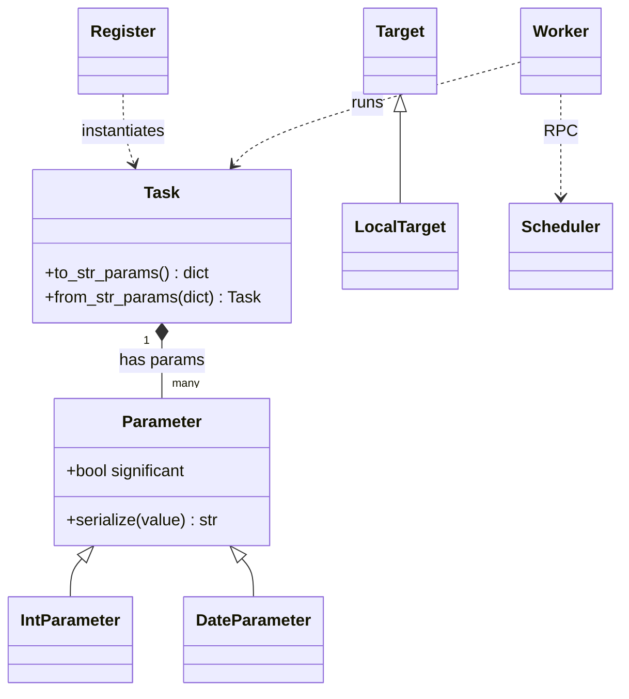

# Reverse-Engineered Architecture of luigi (RQ1, RQ4)

> How we extracted a block diagram + OOP schema from an unfamiliar codebase with thin docs —
> using the Graphify graph (`reports/graph/graph.json`, 2253 nodes / 3957 edges) rather than prose.

## How the schemas were extracted (RQ4)
We did **not** read 82 files linearly. Instead:
1. Ran `graphify update target_repo/luigi` → AST graph (`graph.json`) with typed edges
   (`calls`, `method`, `contains`, `inherits`, `uses`, `imports_from`).
2. Ranked nodes by degree + betweenness centrality (`reports/graph_report_annotated.md`).
   The top **code** God Nodes are `Task` (deg 43), `CentralPlannerScheduler` (deg 55),
   `Parameter` (deg 42), `Worker` (deg 35), `Target`.
3. The **block diagram** = those God Nodes + the real edges between them.
4. The **OOP diagram** = the `inherits`/`method`/`uses` edges projected onto the central classes.

## What wasn't obvious at first glance (RQ1)
- A `Register` **metaclass** silently instantiates every `Task` — not visible from a folder listing,
  but it surfaces as an edge into `Task`.
- `six` and a vendored `static/` jQuery asset appear as high-degree nodes — **noise** God Nodes
  (a compat shim and a bundled JS file), distinct from the *architectural* God Nodes. Flagging both,
  and explaining the difference, is part of honest reverse engineering.
- The bug's locus, `Task.to_str_params`, sits one hop from the most central class — so a graph-guided
  agent reaches it almost immediately (see the token comparison).

## Architectural block diagram (H7)
```mermaid
flowchart TD
    IFACE["interface.py (run/build)"] -->|builds| TASK["Task (God Node)"]
    REGISTER["Register (metaclass)"] -.->|metaclass| TASK
    TASK -->|declares| PARAM["Parameter (significant, serialize)"]
    TASK -->|output()| TARGET["Target / LocalTarget"]
    TASK -->|requires()| TASK
    WORKER["Worker"] -->|runs| TASK
    WORKER <-->|RPC| SCHED["CentralPlannerScheduler (God Node)"]
    SCHED -->|tracks state| TASK
```
Source: [`diagrams/block_diagram.mmd`](../diagrams/block_diagram.mmd).

## OOP / class diagram (H8)

Source: [`diagrams/oop_diagram.mmd`](../diagrams/oop_diagram.mmd).

## Most central components (RQ2) / hotspots (RQ3)
See `reports/graph_report_annotated.md` for the ranked centrality table and the
`CRITICAL`/`WARNING` God-Node tiers. The architectural hubs (`Task`, `Scheduler`, `Parameter`,
`Worker`) concentrate responsibility; `Task` mixing identity, scheduling hooks, and (de)serialization
is the mixed-responsibility hotspot that hides our bug.
