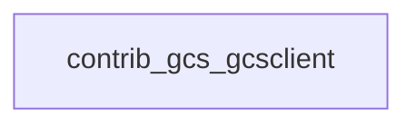

# GCSClient

Graph node `contrib_gcs_gcsclient`.

## Neighbours
- _(leaf node)_

## Neighbourhood


```mermaid
flowchart LR
    contrib_gcs_gcsclient
```

## Related (Dataview)

```dataview
LIST FROM #community/5
```
