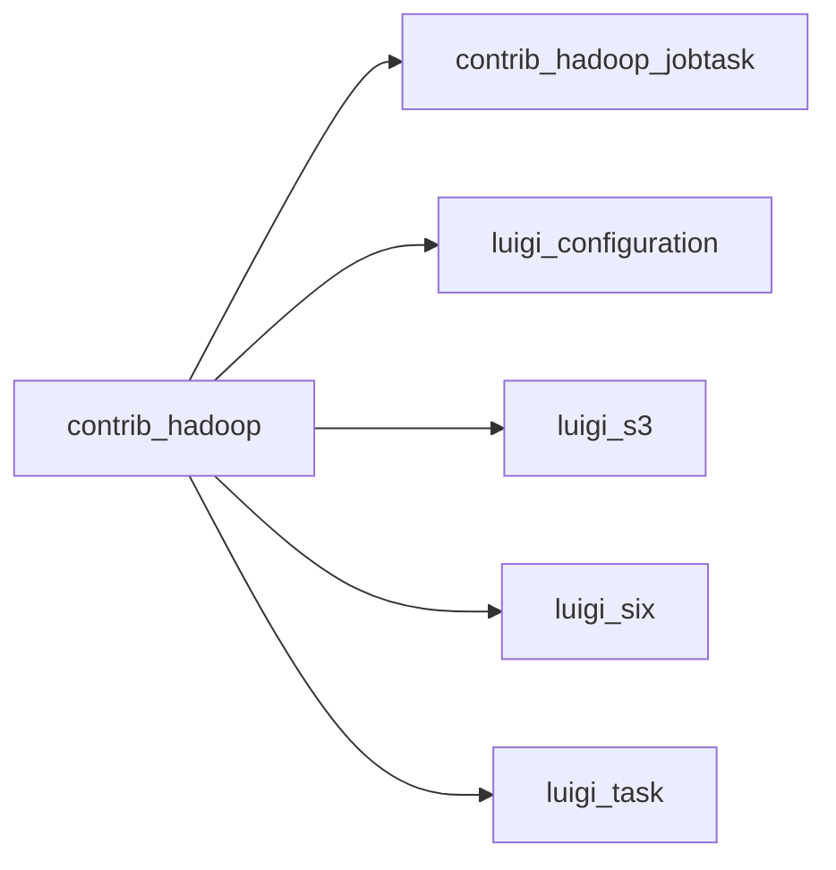

# hadoop.py

Graph node `contrib_hadoop`.

## Neighbours
- [[contrib_hadoop_jobtask]]
- [[luigi_configuration]]
- [[luigi_s3]]
- [[luigi_six]]
- [[luigi_task]]

## Neighbourhood



## Related (Dataview)

```dataview
LIST FROM #community/80
```
