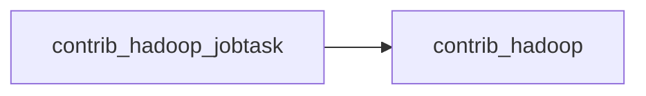

# JobTask

Graph node `contrib_hadoop_jobtask`.

## Neighbours
- [[contrib_hadoop]]

## Neighbourhood


```mermaid
flowchart LR
    contrib_hadoop_jobtask --> contrib_hadoop
```

## Related (Dataview)

```dataview
LIST FROM #community/45
```
