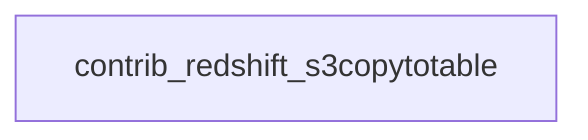

# S3CopyToTable

Graph node `contrib_redshift_s3copytotable`.

## Neighbours
- _(leaf node)_

## Neighbourhood


```mermaid
flowchart LR
    contrib_redshift_s3copytotable
```

## Related (Dataview)

```dataview
LIST FROM #community/29
```
