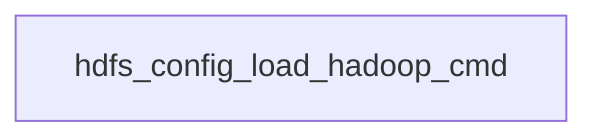

# load_hadoop_cmd()

Graph node `hdfs_config_load_hadoop_cmd`.

## Neighbours
- _(leaf node)_

## Neighbourhood


```mermaid
flowchart LR
    hdfs_config_load_hadoop_cmd
```

## Related (Dataview)

```dataview
LIST FROM #community/39
```
