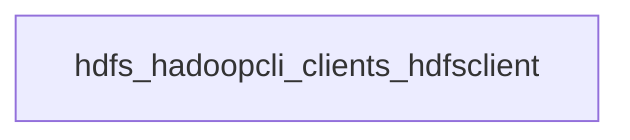

# HdfsClient

Graph node `hdfs_hadoopcli_clients_hdfsclient`.

## Neighbours
- _(leaf node)_

## Neighbourhood


```mermaid
flowchart LR
    hdfs_hadoopcli_clients_hdfsclient
```

## Related (Dataview)

```dataview
LIST FROM #community/39
```
