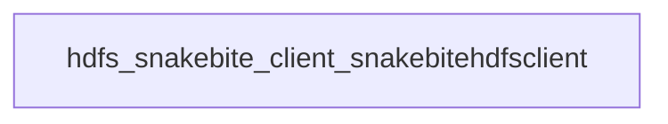

# SnakebiteHdfsClient

Graph node `hdfs_snakebite_client_snakebitehdfsclient`.

## Neighbours
- _(leaf node)_

## Neighbourhood


```mermaid
flowchart LR
    hdfs_snakebite_client_snakebitehdfsclient
```

## Related (Dataview)

```dataview
LIST FROM #community/17
```
