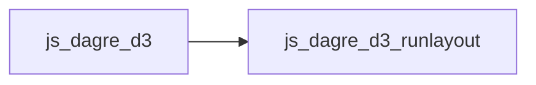

# dagre-d3.js

Graph node `js_dagre_d3`.

## Neighbours
- [[js_dagre_d3_runlayout]]

## Neighbourhood


```mermaid
flowchart LR
    js_dagre_d3 --> js_dagre_d3_runlayout
```

## Related (Dataview)

```dataview
LIST FROM #community/3
```
