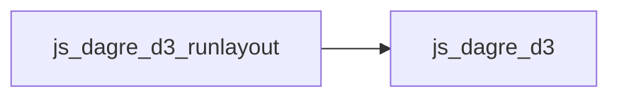

# runLayout()

Graph node `js_dagre_d3_runlayout`.

## Neighbours
- [[js_dagre_d3]]

## Neighbourhood


```mermaid
flowchart LR
    js_dagre_d3_runlayout --> js_dagre_d3
```

## Related (Dataview)

```dataview
LIST FROM #community/30
```
