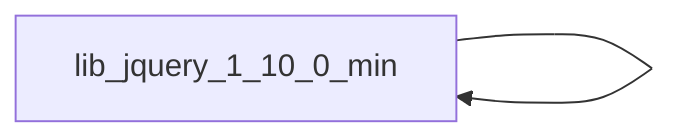

# $()

Graph node `lib_jquery_1_10_0_min`.

## Neighbours
- [[lib_jquery_1_10_0_min]]

## Neighbourhood


```mermaid
flowchart LR
    lib_jquery_1_10_0_min --> lib_jquery_1_10_0_min
```

## Related (Dataview)

```dataview
LIST FROM #community/20
```
