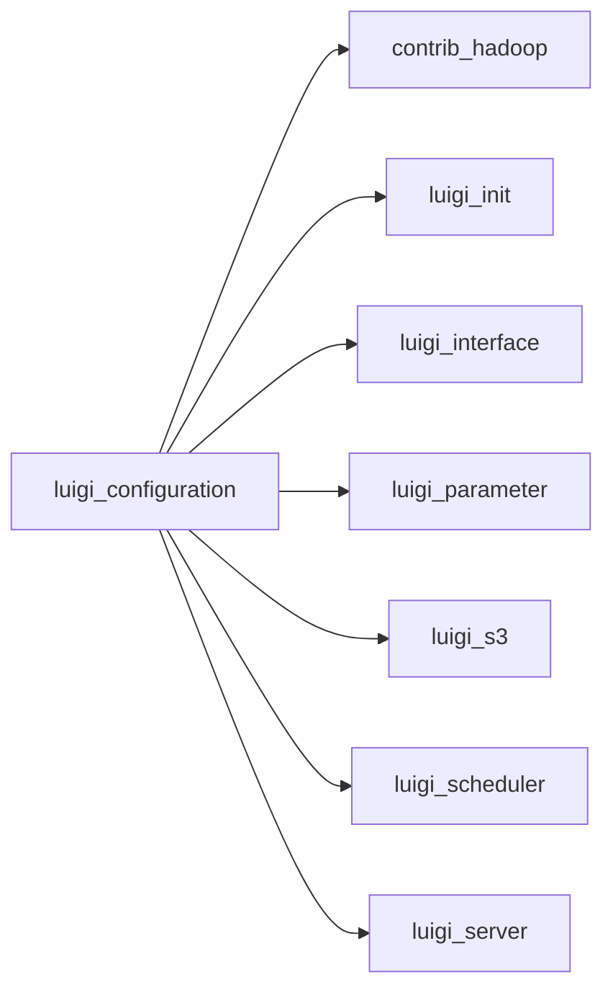

# configuration.py

Graph node `luigi_configuration`.

## Neighbours
- [[contrib_hadoop]]
- [[luigi_init]]
- [[luigi_interface]]
- [[luigi_parameter]]
- [[luigi_s3]]
- [[luigi_scheduler]]
- [[luigi_server]]

## Neighbourhood



## Related (Dataview)

```dataview
LIST FROM #community/2
```
