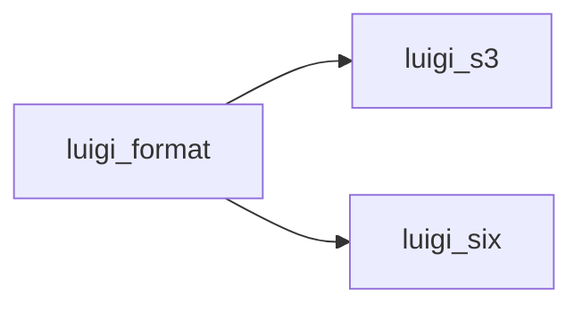

# format.py

Graph node `luigi_format`.

## Neighbours
- [[luigi_s3]]
- [[luigi_six]]

## Neighbourhood


```mermaid
flowchart LR
    luigi_format --> luigi_s3
    luigi_format --> luigi_six
```

## Related (Dataview)

```dataview
LIST FROM #community/36
```
