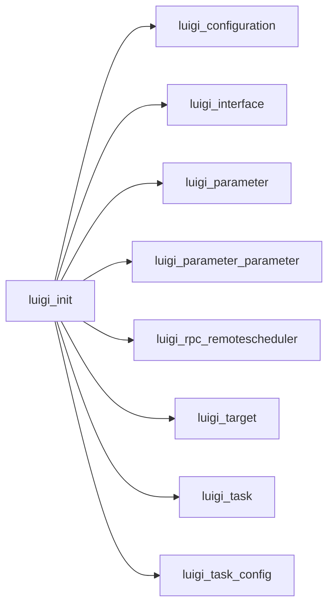

# __init__.py

Graph node `luigi_init`.

## Neighbours
- [[luigi_configuration]]
- [[luigi_interface]]
- [[luigi_parameter]]
- [[luigi_parameter_parameter]]
- [[luigi_rpc_remotescheduler]]
- [[luigi_target]]
- [[luigi_task]]
- [[luigi_task_config]]
- [[luigi_task_externaltask]]
- [[luigi_task_task]]
- [[luigi_task_wrappertask]]
- [[tools_range]]

## Neighbourhood



## Related (Dataview)

```dataview
LIST FROM #community/6
```
