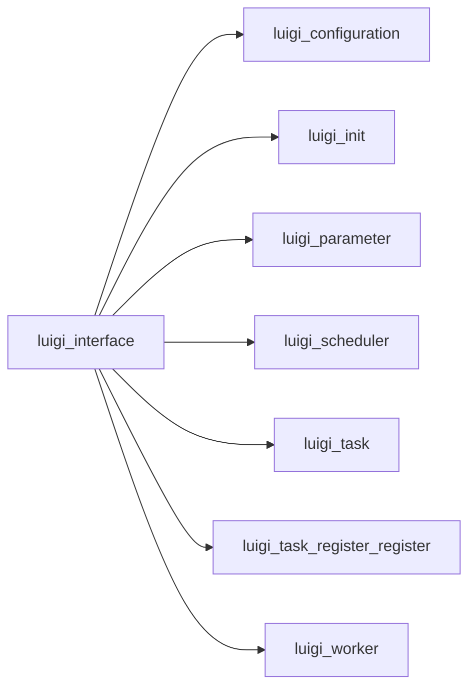

# interface.py

Graph node `luigi_interface`.

## Neighbours
- [[luigi_configuration]]
- [[luigi_init]]
- [[luigi_parameter]]
- [[luigi_scheduler]]
- [[luigi_task]]
- [[luigi_task_register_register]]
- [[luigi_worker]]

## Neighbourhood



## Related (Dataview)

```dataview
LIST FROM #community/19
```
