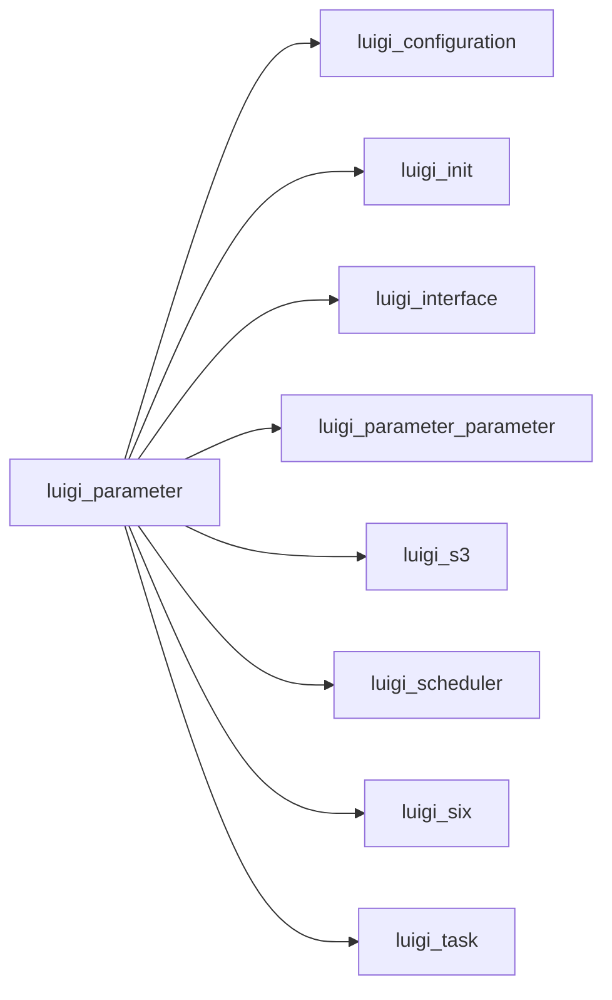

# parameter.py

Graph node `luigi_parameter`.

## Neighbours
- [[luigi_configuration]]
- [[luigi_init]]
- [[luigi_interface]]
- [[luigi_parameter_parameter]]
- [[luigi_s3]]
- [[luigi_scheduler]]
- [[luigi_six]]
- [[luigi_task]]
- [[luigi_worker]]
- [[tools_range]]

## Neighbourhood



## Related (Dataview)

```dataview
LIST FROM #community/2
```
