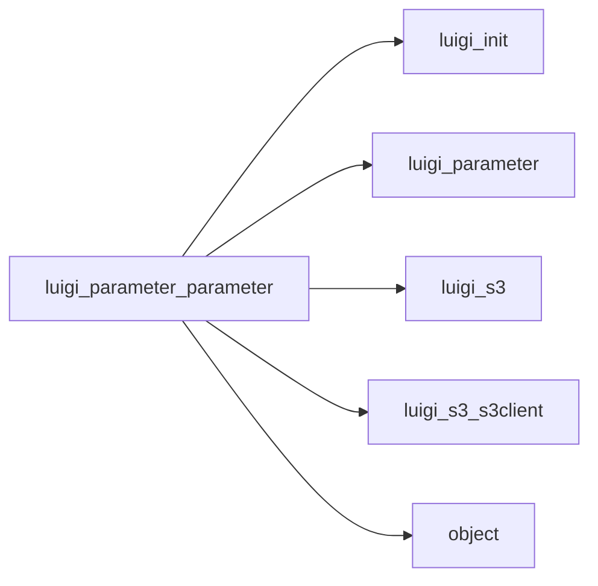

# Parameter

Graph node `luigi_parameter_parameter`.

## Neighbours
- [[luigi_init]]
- [[luigi_parameter]]
- [[luigi_s3]]
- [[luigi_s3_s3client]]
- [[object]]

## Neighbourhood



## Related (Dataview)

```dataview
LIST FROM #community/14
```
