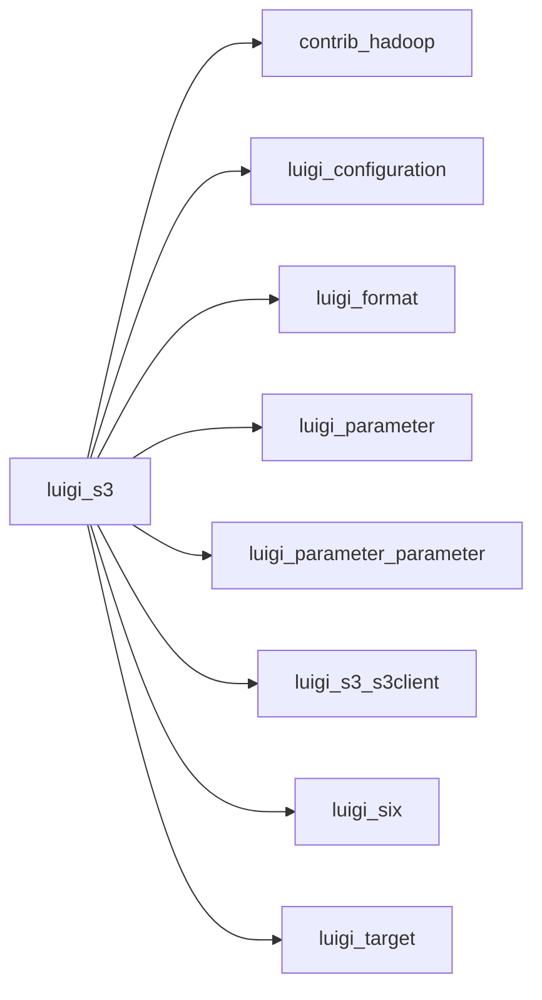

# s3.py

Graph node `luigi_s3`.

## Neighbours
- [[contrib_hadoop]]
- [[luigi_configuration]]
- [[luigi_format]]
- [[luigi_parameter]]
- [[luigi_parameter_parameter]]
- [[luigi_s3_s3client]]
- [[luigi_six]]
- [[luigi_target]]
- [[luigi_target_filesystemtarget]]
- [[luigi_task]]
- [[luigi_task_externaltask]]

## Neighbourhood



## Related (Dataview)

```dataview
LIST FROM #community/0
```
