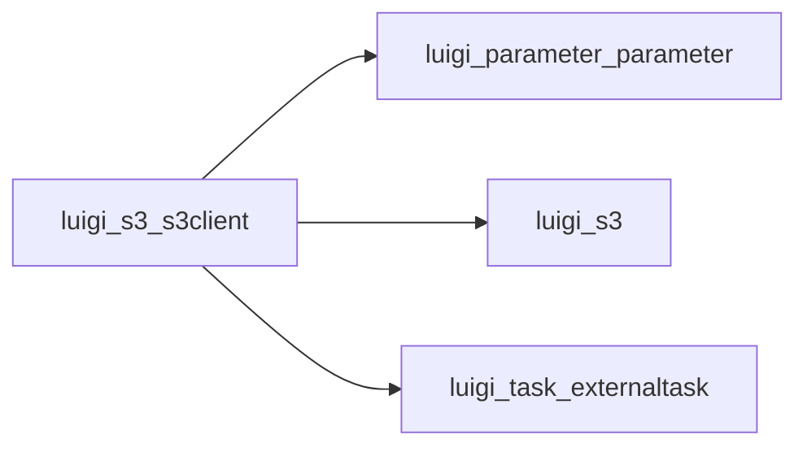

# S3Client

Graph node `luigi_s3_s3client`.

## Neighbours
- [[luigi_parameter_parameter]]
- [[luigi_s3]]
- [[luigi_task_externaltask]]

## Neighbourhood



## Related (Dataview)

```dataview
LIST FROM #community/21
```
