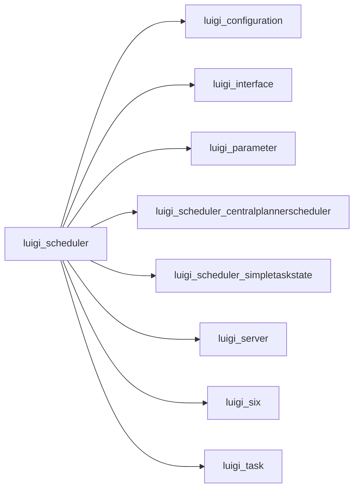

# scheduler.py

Graph node `luigi_scheduler`.

## Neighbours
- [[luigi_configuration]]
- [[luigi_interface]]
- [[luigi_parameter]]
- [[luigi_scheduler_centralplannerscheduler]]
- [[luigi_scheduler_simpletaskstate]]
- [[luigi_server]]
- [[luigi_six]]
- [[luigi_task]]
- [[luigi_task_config]]
- [[luigi_worker]]

## Neighbourhood



## Related (Dataview)

```dataview
LIST FROM #community/7
```
