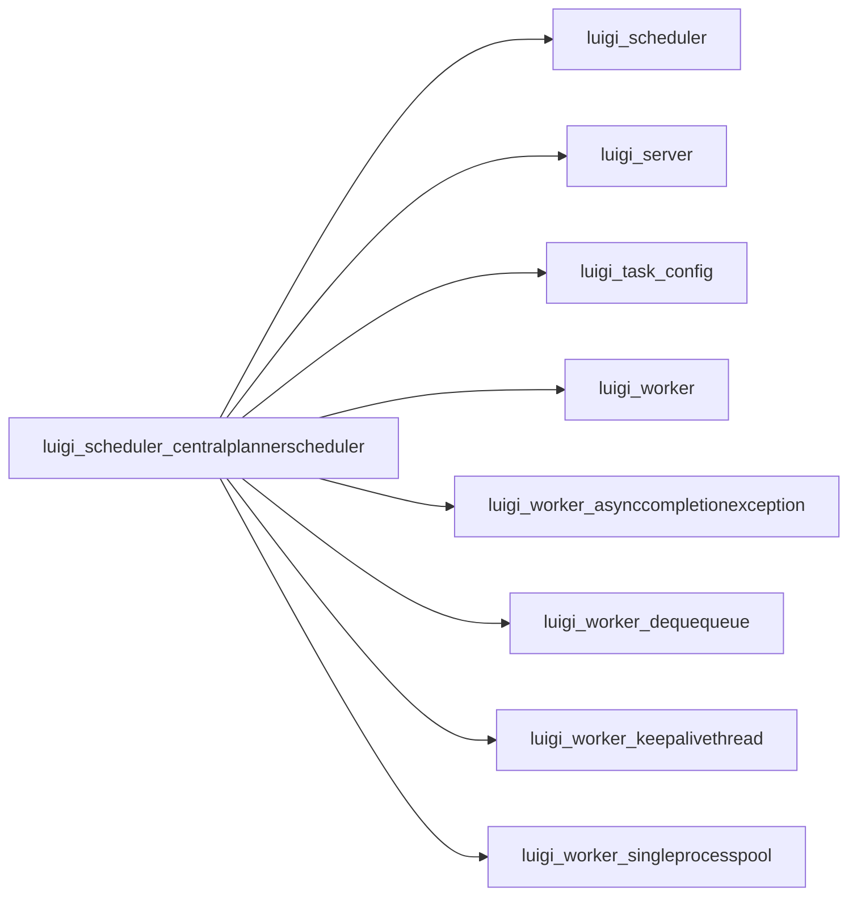

# CentralPlannerScheduler

Graph node `luigi_scheduler_centralplannerscheduler`.

## Neighbours
- [[luigi_scheduler]]
- [[luigi_server]]
- [[luigi_task_config]]
- [[luigi_worker]]
- [[luigi_worker_asynccompletionexception]]
- [[luigi_worker_dequequeue]]
- [[luigi_worker_keepalivethread]]
- [[luigi_worker_singleprocesspool]]
- [[luigi_worker_taskexception]]
- [[luigi_worker_taskprocess]]
- [[luigi_worker_tracebackwrapper]]
- [[luigi_worker_worker]]

## Neighbourhood



## Related (Dataview)

```dataview
LIST FROM #community/42
```
