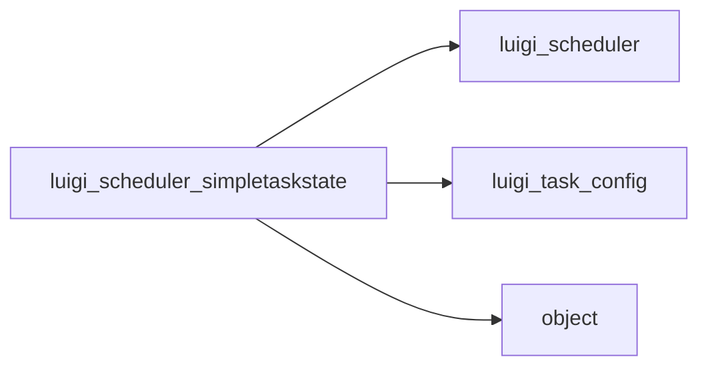

# SimpleTaskState

Graph node `luigi_scheduler_simpletaskstate`.

## Neighbours
- [[luigi_scheduler]]
- [[luigi_task_config]]
- [[object]]

## Neighbourhood



## Related (Dataview)

```dataview
LIST FROM #community/43
```
