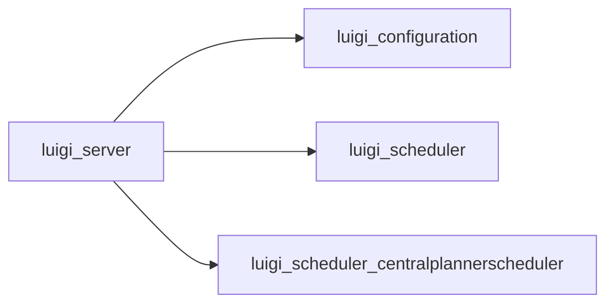

# server.py

Graph node `luigi_server`.

## Neighbours
- [[luigi_configuration]]
- [[luigi_scheduler]]
- [[luigi_scheduler_centralplannerscheduler]]

## Neighbourhood



## Related (Dataview)

```dataview
LIST FROM #community/18
```
