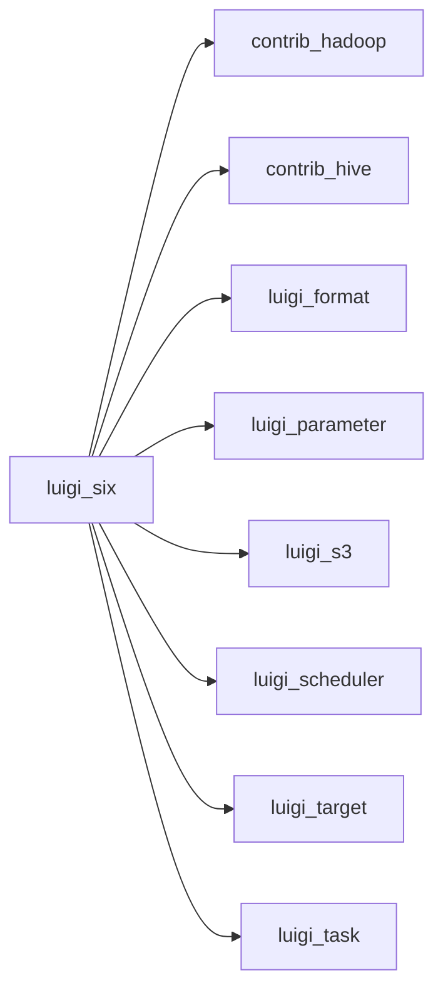

# six.py

Graph node `luigi_six`.

## Neighbours
- [[contrib_hadoop]]
- [[contrib_hive]]
- [[luigi_format]]
- [[luigi_parameter]]
- [[luigi_s3]]
- [[luigi_scheduler]]
- [[luigi_target]]
- [[luigi_task]]
- [[luigi_worker]]
- [[tools_range]]

## Neighbourhood



## Related (Dataview)

```dataview
LIST FROM #community/9
```
