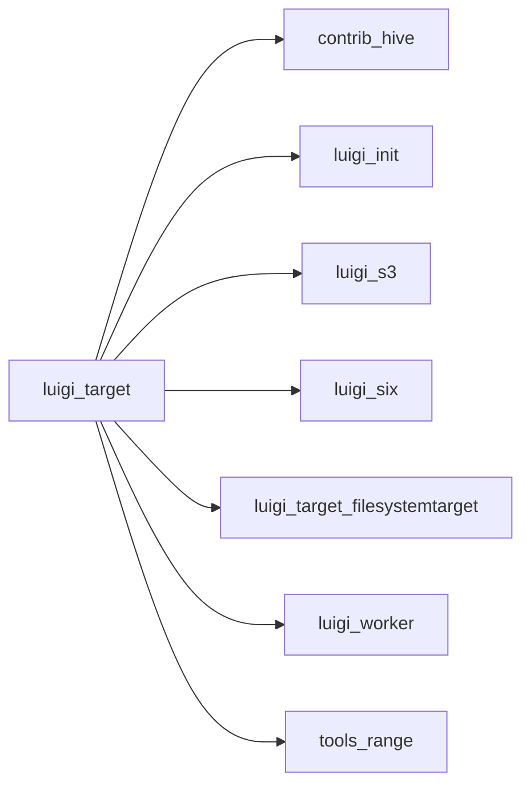

# target.py

Graph node `luigi_target`.

## Neighbours
- [[contrib_hive]]
- [[luigi_init]]
- [[luigi_s3]]
- [[luigi_six]]
- [[luigi_target_filesystemtarget]]
- [[luigi_worker]]
- [[tools_range]]

## Neighbourhood



## Related (Dataview)

```dataview
LIST FROM #community/37
```
