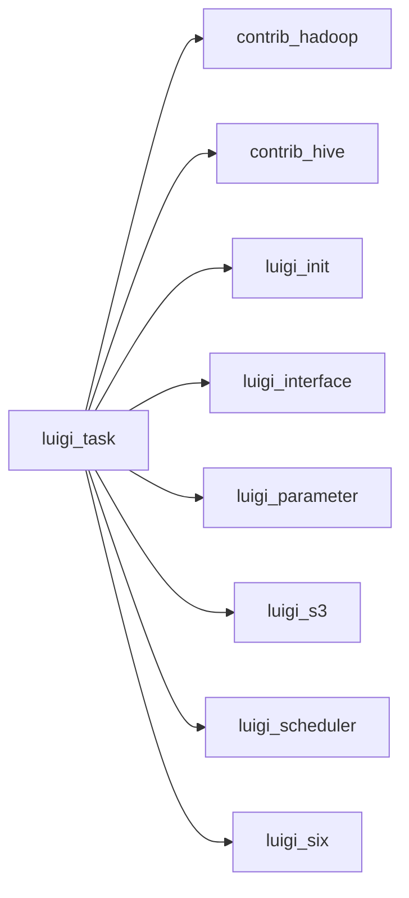

# task.py

Graph node `luigi_task`.

## Neighbours
- [[contrib_hadoop]]
- [[contrib_hive]]
- [[luigi_init]]
- [[luigi_interface]]
- [[luigi_parameter]]
- [[luigi_s3]]
- [[luigi_scheduler]]
- [[luigi_six]]
- [[luigi_task_config]]
- [[luigi_task_externaltask]]
- [[luigi_task_register_register]]
- [[luigi_task_register_taskclassexception]]
- [[luigi_task_task]]
- [[luigi_task_wrappertask]]
- [[luigi_worker]]
- [[tools_range]]

## Neighbourhood



## Related (Dataview)

```dataview
LIST FROM #community/7
```
