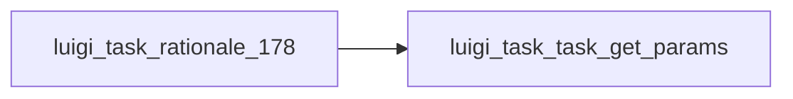

# Returns all of the Parameters for this Task.

Graph node `luigi_task_rationale_178`.

## Neighbours
- [[luigi_task_task_get_params]]

## Neighbourhood



## Related (Dataview)

```dataview
LIST FROM #community/4
```
