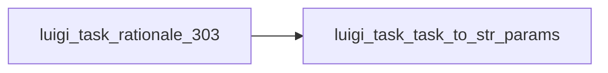

# Convert all parameters to a str->str hash.

Graph node `luigi_task_rationale_303`.

## Neighbours
- [[luigi_task_task_to_str_params]]

## Neighbourhood



## Related (Dataview)

```dataview
LIST FROM #community/4
```
