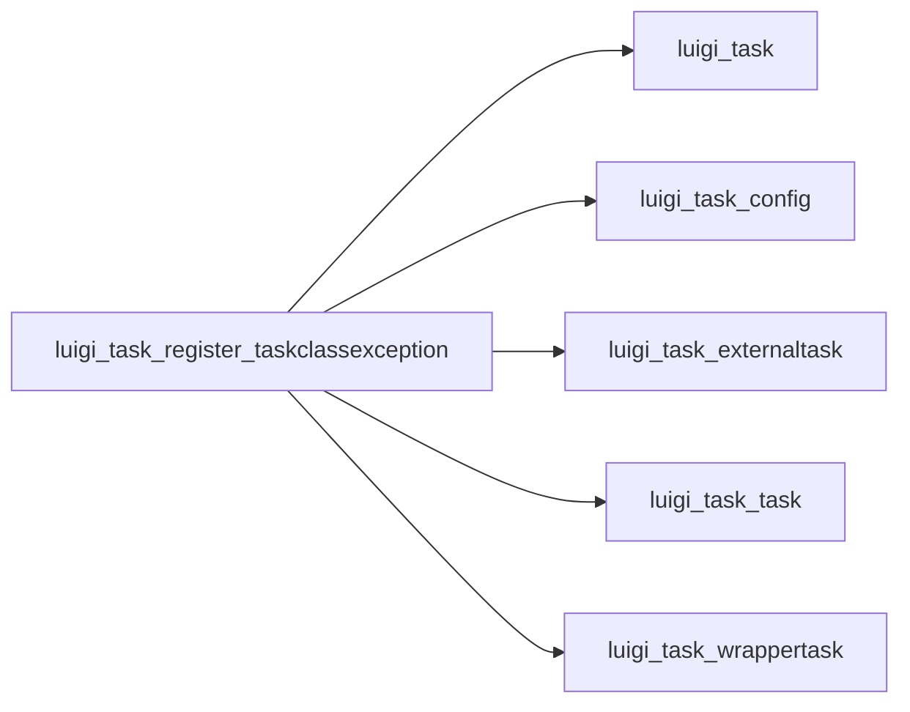

# TaskClassException

Graph node `luigi_task_register_taskclassexception`.

## Neighbours
- [[luigi_task]]
- [[luigi_task_config]]
- [[luigi_task_externaltask]]
- [[luigi_task_task]]
- [[luigi_task_wrappertask]]

## Neighbourhood



## Related (Dataview)

```dataview
LIST FROM #community/11
```
