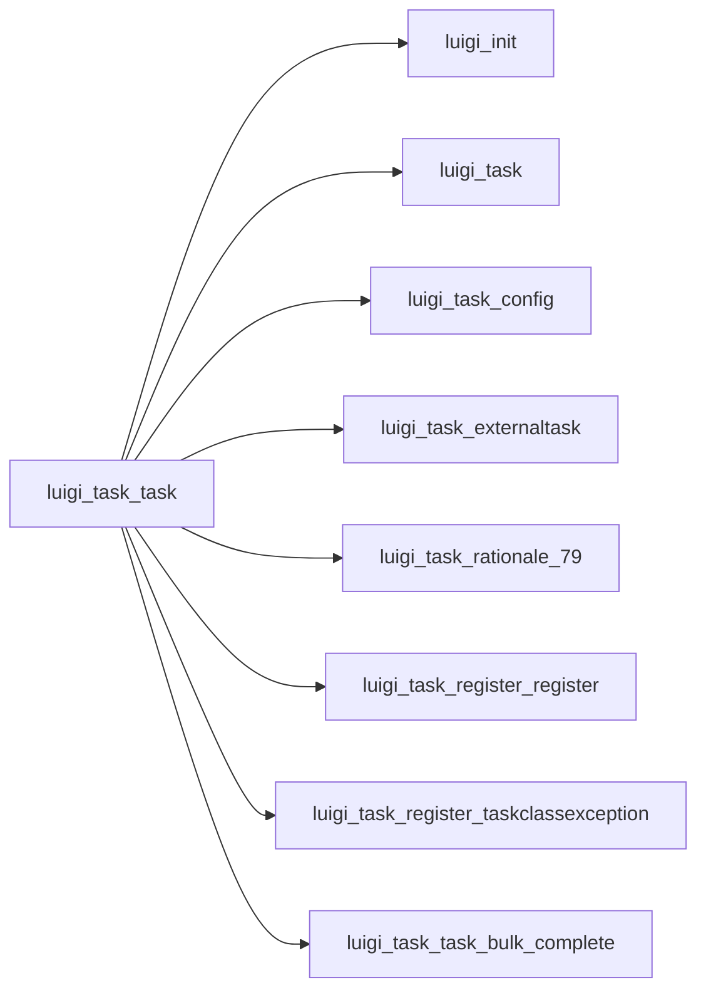

# Task

Graph node `luigi_task_task`.

## Neighbours
- [[luigi_init]]
- [[luigi_task]]
- [[luigi_task_config]]
- [[luigi_task_externaltask]]
- [[luigi_task_rationale_79]]
- [[luigi_task_register_register]]
- [[luigi_task_register_taskclassexception]]
- [[luigi_task_task_bulk_complete]]
- [[luigi_task_task_clone]]
- [[luigi_task_task_complete]]
- [[luigi_task_task_deps]]
- [[luigi_task_task_eq]]
- [[luigi_task_task_event_handler]]
- [[luigi_task_task_from_str_params]]
- [[luigi_task_task_get_param_values]]
- [[luigi_task_task_get_params]]
- [[luigi_task_task_hash]]
- [[luigi_task_task_init]]
- [[luigi_task_task_initialized]]
- [[luigi_task_task_input]]
- [[luigi_task_task_on_failure]]
- [[luigi_task_task_on_success]]
- [[luigi_task_task_output]]
- [[luigi_task_task_process_resources]]
- [[luigi_task_task_repr]]
- [[luigi_task_task_requires]]
- [[luigi_task_task_run]]
- [[luigi_task_task_task_family]]
- [[luigi_task_task_task_module]]
- [[luigi_task_task_to_str_params]]
- [[luigi_task_task_trigger_event]]
- [[luigi_task_task_use_cmdline_section]]
- [[luigi_task_wrappertask]]
- [[luigi_worker]]
- [[luigi_worker_asynccompletionexception]]
- [[luigi_worker_dequequeue]]
- [[luigi_worker_keepalivethread]]
- [[luigi_worker_singleprocesspool]]
- [[luigi_worker_taskexception]]
- [[luigi_worker_taskprocess]]
- [[luigi_worker_tracebackwrapper]]
- [[luigi_worker_worker]]
- [[object]]

## Neighbourhood



## Related (Dataview)

```dataview
LIST FROM #community/4
```
