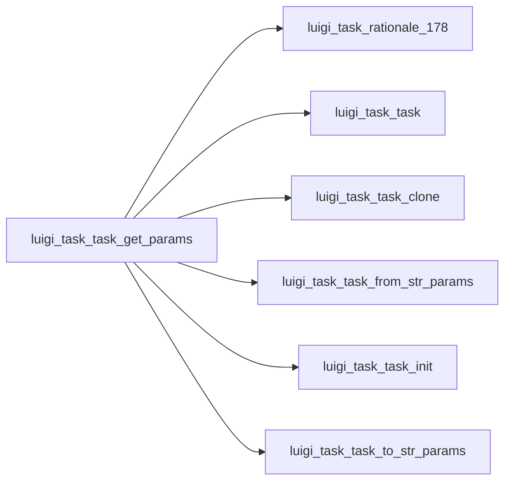

# .get_params()

Graph node `luigi_task_task_get_params`.

## Neighbours
- [[luigi_task_rationale_178]]
- [[luigi_task_task]]
- [[luigi_task_task_clone]]
- [[luigi_task_task_from_str_params]]
- [[luigi_task_task_init]]
- [[luigi_task_task_to_str_params]]

## Neighbourhood



## Related (Dataview)

```dataview
LIST FROM #community/4
```
