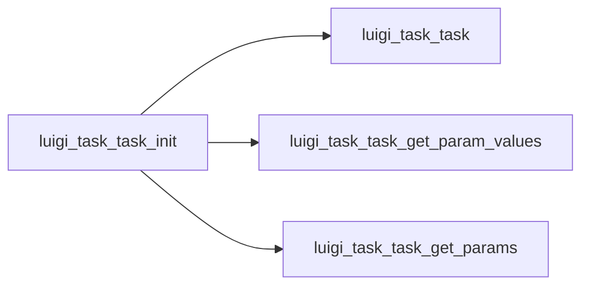

# .__init__()

Graph node `luigi_task_task_init`.

## Neighbours
- [[luigi_task_task]]
- [[luigi_task_task_get_param_values]]
- [[luigi_task_task_get_params]]

## Neighbourhood



## Related (Dataview)

```dataview
LIST FROM #community/4
```
