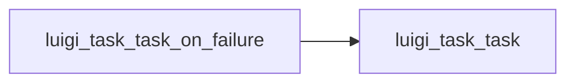

# .on_failure()

Graph node `luigi_task_task_on_failure`.

## Neighbours
- [[luigi_task_task]]

## Neighbourhood


```mermaid
flowchart LR
    luigi_task_task_on_failure --> luigi_task_task
```

## Related (Dataview)

```dataview
LIST FROM #community/4
```
