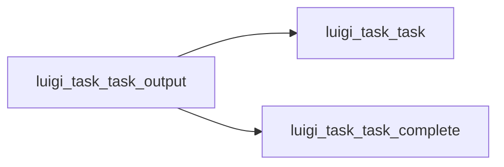

# .output()

Graph node `luigi_task_task_output`.

## Neighbours
- [[luigi_task_task]]
- [[luigi_task_task_complete]]

## Neighbourhood



## Related (Dataview)

```dataview
LIST FROM #community/4
```
