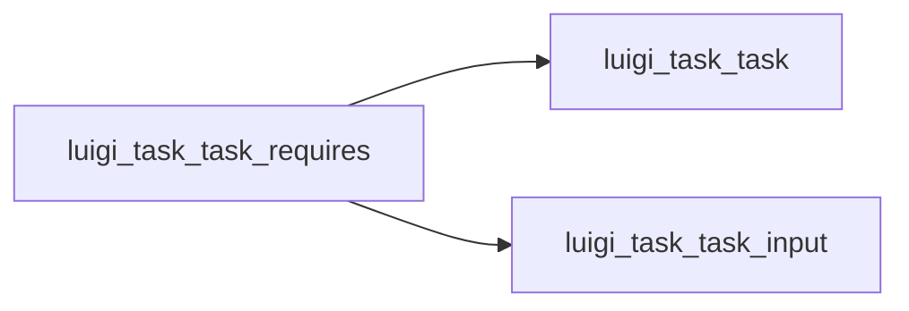

# .requires()

Graph node `luigi_task_task_requires`.

## Neighbours
- [[luigi_task_task]]
- [[luigi_task_task_input]]

## Neighbourhood



## Related (Dataview)

```dataview
LIST FROM #community/7
```
