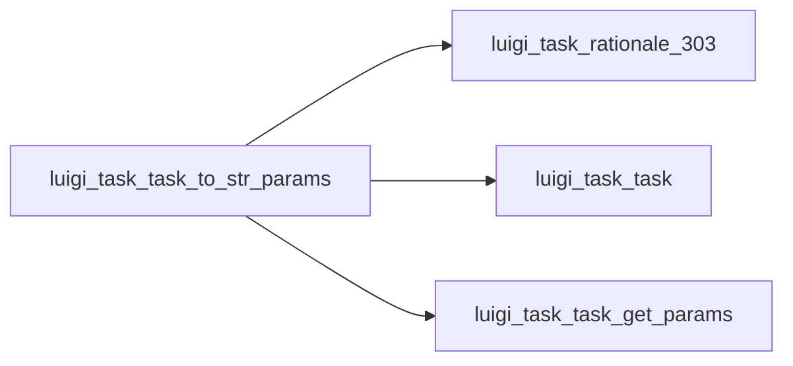

# .to_str_params()

Graph node `luigi_task_task_to_str_params`.

## Neighbours
- [[luigi_task_rationale_303]]
- [[luigi_task_task]]
- [[luigi_task_task_get_params]]

## Neighbourhood



## Related (Dataview)

```dataview
LIST FROM #community/4
```
