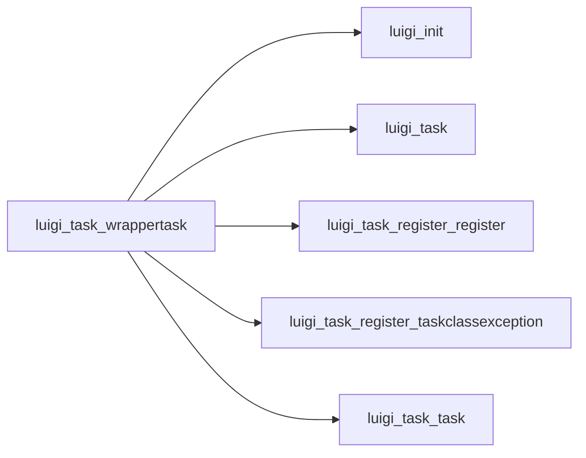

# WrapperTask

Graph node `luigi_task_wrappertask`.

## Neighbours
- [[luigi_init]]
- [[luigi_task]]
- [[luigi_task_register_register]]
- [[luigi_task_register_taskclassexception]]
- [[luigi_task_task]]

## Neighbourhood



## Related (Dataview)

```dataview
LIST FROM #community/7
```
