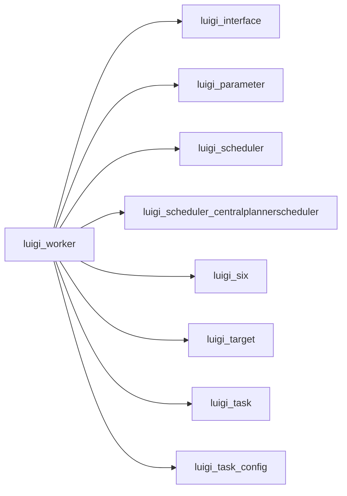

# worker.py

Graph node `luigi_worker`.

## Neighbours
- [[luigi_interface]]
- [[luigi_parameter]]
- [[luigi_scheduler]]
- [[luigi_scheduler_centralplannerscheduler]]
- [[luigi_six]]
- [[luigi_target]]
- [[luigi_task]]
- [[luigi_task_config]]
- [[luigi_task_task]]
- [[luigi_worker_asynccompletionexception]]
- [[luigi_worker_dequequeue]]
- [[luigi_worker_keepalivethread]]
- [[luigi_worker_singleprocesspool]]
- [[luigi_worker_taskexception]]
- [[luigi_worker_taskprocess]]
- [[luigi_worker_tracebackwrapper]]
- [[luigi_worker_worker]]

## Neighbourhood



## Related (Dataview)

```dataview
LIST FROM #community/6
```
