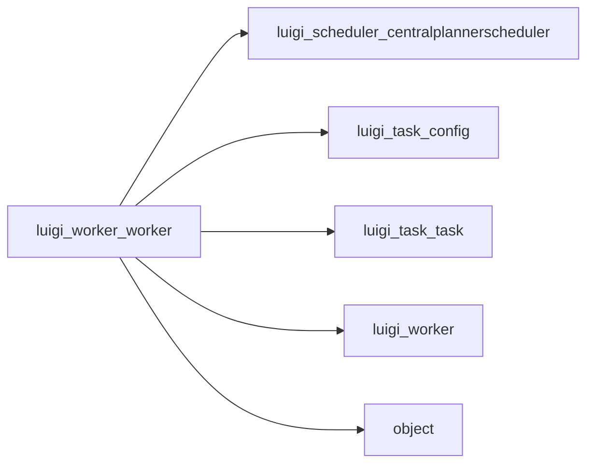

# worker

Graph node `luigi_worker_worker`.

## Neighbours
- [[luigi_scheduler_centralplannerscheduler]]
- [[luigi_task_config]]
- [[luigi_task_task]]
- [[luigi_worker]]
- [[object]]

## Neighbourhood



## Related (Dataview)

```dataview
LIST FROM #community/10
```
