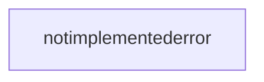

# NotImplementedError

Graph node `notimplementederror`.

## Neighbours
- _(leaf node)_

## Neighbourhood


```mermaid
flowchart LR
    notimplementederror
```

## Related (Dataview)

```dataview
LIST FROM #community/28
```
