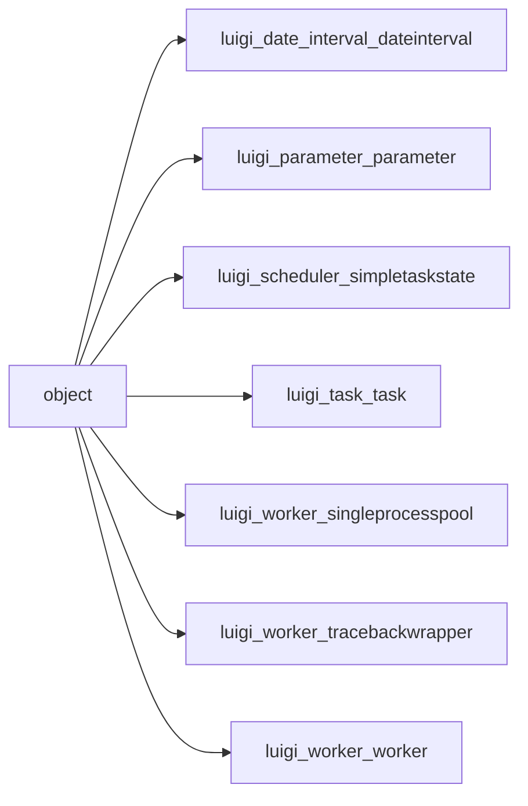

# object

Graph node `object`.

## Neighbours
- [[luigi_date_interval_dateinterval]]
- [[luigi_parameter_parameter]]
- [[luigi_scheduler_simpletaskstate]]
- [[luigi_task_task]]
- [[luigi_worker_singleprocesspool]]
- [[luigi_worker_tracebackwrapper]]
- [[luigi_worker_worker]]

## Neighbourhood



## Related (Dataview)

```dataview
LIST FROM #community/53
```
