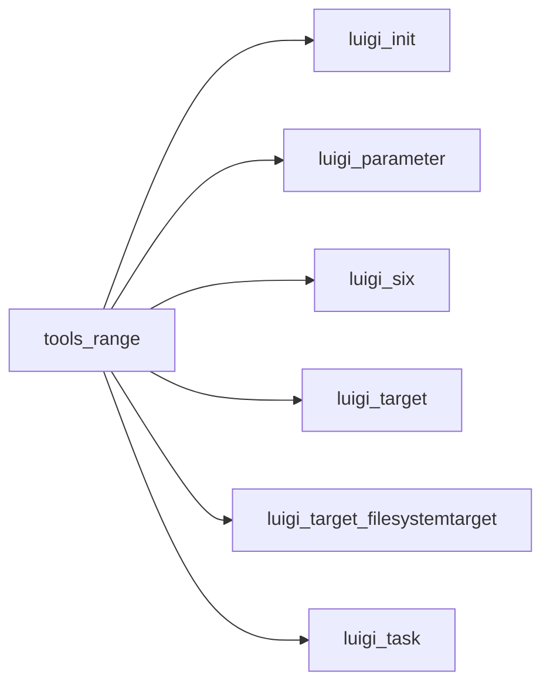

# range.py

Graph node `tools_range`.

## Neighbours
- [[luigi_init]]
- [[luigi_parameter]]
- [[luigi_six]]
- [[luigi_target]]
- [[luigi_target_filesystemtarget]]
- [[luigi_task]]

## Neighbourhood



## Related (Dataview)

```dataview
LIST FROM #community/2
```
